---
Lab 02 - Plastic waste
================
Heather Hawkins
01/17/23

---

## Load packages and data


```r
library(tidyverse) 
```


```r
plastic_waste <- read_csv("data/plastic-waste.csv")
```
## Exercises

### Exercise 1


```r
ggplot(data = plastic_waste, aes(x = plastic_waste_per_cap)) +
  geom_histogram(binwidth = 0.2)
```

```
## Warning: Removed 51 rows containing non-finite values (`stat_bin()`).
```

<!-- -->


```r
plastic_waste %>%
  filter(plastic_waste_per_cap > 3.5)
```

```
## # A tibble: 1 × 10
##   code  entity     conti…¹  year gdp_p…² plast…³ misma…⁴ misma…⁵ coast…⁶ total…⁷
##   <chr> <chr>      <chr>   <dbl>   <dbl>   <dbl>   <dbl>   <dbl>   <dbl>   <dbl>
## 1 TTO   Trinidad … North …  2010  31261.     3.6    0.19   94066 1358433 1341465
## # … with abbreviated variable names ¹​continent, ²​gdp_per_cap,
## #   ³​plastic_waste_per_cap, ⁴​mismanaged_plastic_waste_per_cap,
## #   ⁵​mismanaged_plastic_waste, ⁶​coastal_pop, ⁷​total_pop
```

This is not surprising since Trinidad and Tobago have a lack of waste segregation among households alongside inefficient waste management systems.


```r
ggplot(data = plastic_waste, aes(x = plastic_waste_per_cap)) +
  geom_histogram(binwidth = 0.2)+
         facet_wrap(~continent) 
```

```
## Warning: Removed 51 rows containing non-finite values (`stat_bin()`).
```

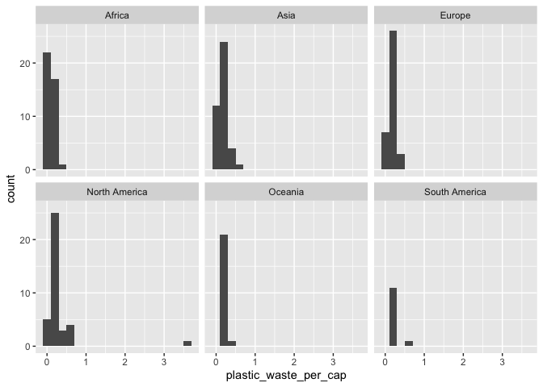<!-- -->

Asia, Europe, and North America seem to have the most waste per capita. The Oceania and South America seem to have the least. 


```r
ggplot(data = plastic_waste,
       aes(x = plastic_waste_per_cap)) +
  geom_density()
```

```
## Warning: Removed 51 rows containing non-finite values (`stat_density()`).
```

<!-- -->

```r
ggplot(data = plastic_waste, 
       mapping = aes(x = plastic_waste_per_cap, 
                     color = continent)) +
  geom_density()
```

```
## Warning: Removed 51 rows containing non-finite values (`stat_density()`).
```

<!-- -->

```r
ggplot(data = plastic_waste, 
       mapping = aes(x = plastic_waste_per_cap, 
                     color = continent, 
                     fill = continent)) +
  geom_density()
```

```
## Warning: Removed 51 rows containing non-finite values (`stat_density()`).
```

<!-- -->

```r
ggplot(data = plastic_waste, 
       mapping = aes(x = plastic_waste_per_cap, 
                     color = continent, 
                     fill = continent)) +
  geom_density(alpha = 0.7)
```

```
## Warning: Removed 51 rows containing non-finite values (`stat_density()`).
```

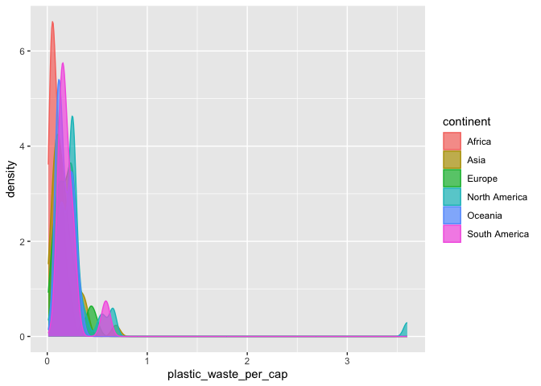<!-- -->

### Exercise 2.1


```r
ggplot(data = plastic_waste, 
       mapping = aes(x = plastic_waste_per_cap, 
                     color = continent, 
                     fill = continent)) +
  geom_density(alpha = 0.2)
```

```
## Warning: Removed 51 rows containing non-finite values (`stat_density()`).
```

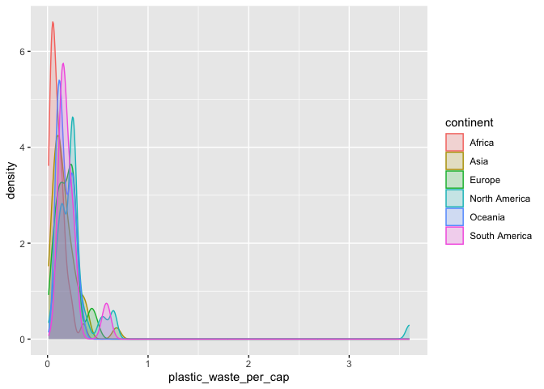<!-- -->

### Exercise 2.2

By defining the color and fill for continent through mapping the aesthetics, we can set individual colors and color fills for each continent. By defining the alpha level through the plotting gem, every continent's characteristic can be changed. Plotting Gem affects every data point while mapping aesthesics separates each category. 

### Exercise 3.1
(OG boxplot)

Blox plots show us where most of the data is, as well as individual outliers that occur.


```r
ggplot(data = plastic_waste, 
       mapping = aes(x = continent, 
                     y = plastic_waste_per_cap)) +
  geom_boxplot(alpha = 0.7)
```

```
## Warning: Removed 51 rows containing non-finite values (`stat_boxplot()`).
```

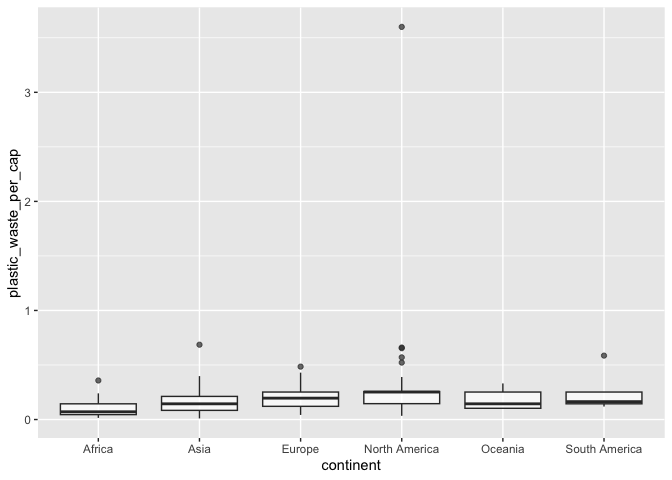<!-- -->

(Violin Plot)

The violin plot show us the density and distribution of data points in waves, we can see exactly where it is most concentrated and where it is not.


```r
ggplot(data = plastic_waste, 
       mapping = aes(x = continent, 
                     y = plastic_waste_per_cap)) +
  geom_violin()
```

```
## Warning: Removed 51 rows containing non-finite values (`stat_ydensity()`).
```

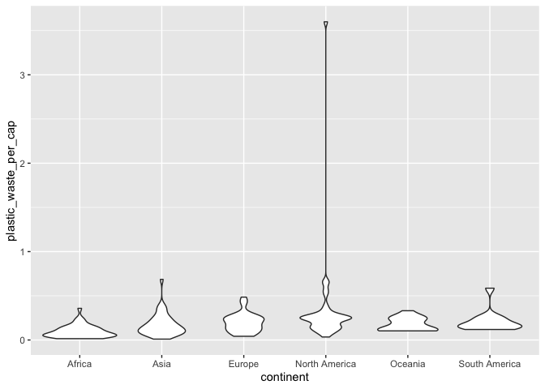<!-- -->


```r
ggplot(data = plastic_waste, 
       mapping = aes(x = continent, 
                     y = plastic_waste_per_cap)) +
  geom_violin()+
  geom_boxplot(width=.3, fill="green") +
  stat_summary(fun.y=median, geom="point") 
```

```
## Warning: The `fun.y` argument of `stat_summary()` is deprecated as of ggplot2 3.3.0.
## ℹ Please use the `fun` argument instead.
```

```
## Warning: Removed 51 rows containing non-finite values (`stat_ydensity()`).
```

```
## Warning: Removed 51 rows containing non-finite values (`stat_boxplot()`).
```

```
## Warning: Removed 51 rows containing non-finite values (`stat_summary()`).
```

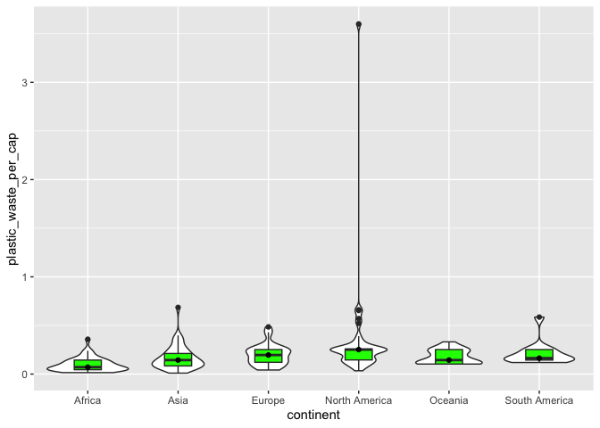<!-- -->

### Exercise 4.1

Scatterplot for the relationship of plastic waste per capita and mismanaged plastic waste per capita. 


```r
ggplot(data = plastic_waste, 
       mapping = aes(x = mismanaged_plastic_waste_per_cap, 
                     y = plastic_waste_per_cap)) +
  geom_point()
```

```
## Warning: Removed 51 rows containing missing values (`geom_point()`).
```

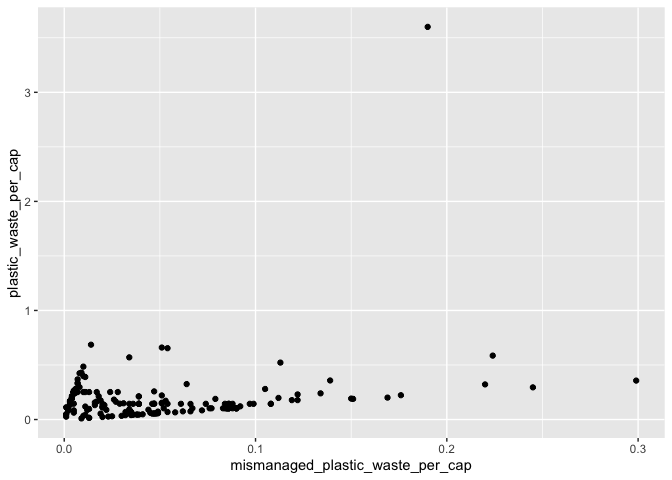<!-- -->

### Exercise 4.2

Color the points in the scatterplot by continent. Does there seem to be any clear distinctions between continents with respect to how plastic waste per capita and mismanaged plastic waste per capita are associated?


```r
ggplot(data = plastic_waste, 
       mapping = aes(x = mismanaged_plastic_waste_per_cap, 
                     y = plastic_waste_per_cap, color = continent)) +
  geom_point()
```

```
## Warning: Removed 51 rows containing missing values (`geom_point()`).
```

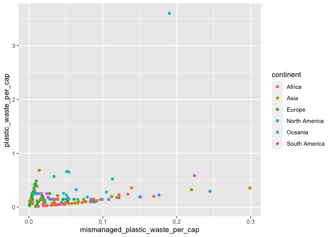<!-- -->

### Exercise 4.3

Visualize the relationship between plastic waste per capita and total population as well as plastic waste per capita and coastal population. You will need to make two separate plots. Do either of these pairs of variables appear to be more strongly linearly associated?


```r
ggplot(data = plastic_waste, 
       mapping = aes(x = total_pop,
                     y = plastic_waste_per_cap))+
  geom_point()
```

```
## Warning: Removed 61 rows containing missing values (`geom_point()`).
```

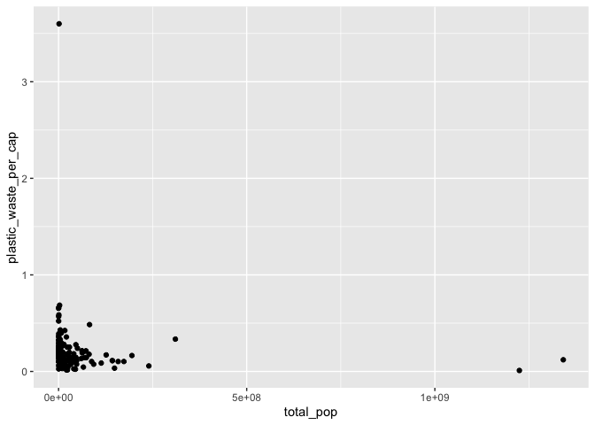<!-- -->


```r
ggplot(data = plastic_waste, 
       mapping = aes(x = coastal_pop,
                     y = plastic_waste_per_cap))+
  geom_point()
```

```
## Warning: Removed 51 rows containing missing values (`geom_point()`).
```

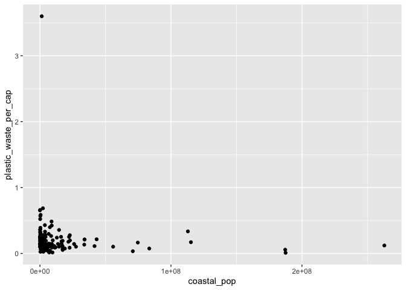<!-- -->

Visually, The relationship between plastic waste per capita and total population seems similar to the relationship plastic waste per capita and coastal population. 


```r
  cor(plastic_waste$plastic_waste_per_cap, plastic_waste$total_pop, use = "pairwise.complete.obs")
```

```
## [1] -0.07318113
```


```r
  cor(plastic_waste$plastic_waste_per_cap, plastic_waste$coastal_pop, use = "pairwise.complete.obs")
```

```
## [1] -0.07699641
```
Looking at the actual r numbers, they are only slightly different.

### Exercise 5.1

Recreating plot


```r
df <- plastic_waste
df<- df %>% filter(plastic_waste_per_cap < 3) 
ggplot(df, plastic_waste, 
       mapping = aes(x = coastal_pop/total_pop, 
                     y = plastic_waste_per_cap))+
  geom_point(mapping= aes(color= continent), size=0.8)+ scale_color_manual(values = c("Africa" = "black", "Asia"="darkblue", "Europe" = "blue", "North America"="green", "Oceania"="lightgreen", "South America"="yellow"))+
  geom_smooth(linewidth=0.5, alpha= 0.4, color="black")+
labs(title = "Plastic Waste vs. Coastal Population proportion", size=4,subtitle = "by continent")+
  theme_bw()+
  labs(x = "Coastal/Total Population Proportion", y = "Plastic Waste per Capita")
```

```
## `geom_smooth()` using method = 'loess' and formula = 'y ~ x'
```

```
## Warning: Removed 10 rows containing non-finite values (`stat_smooth()`).
```

```
## Warning: Removed 10 rows containing missing values (`geom_point()`).
```

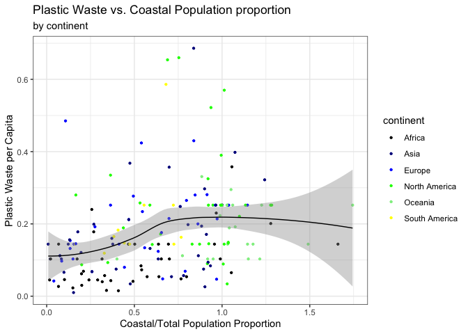<!-- -->


