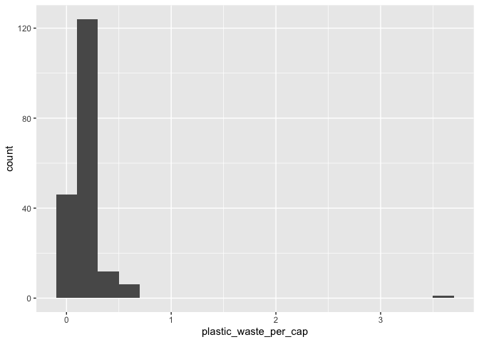
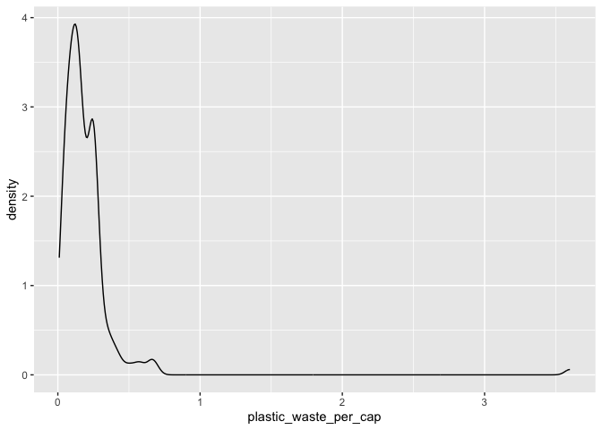
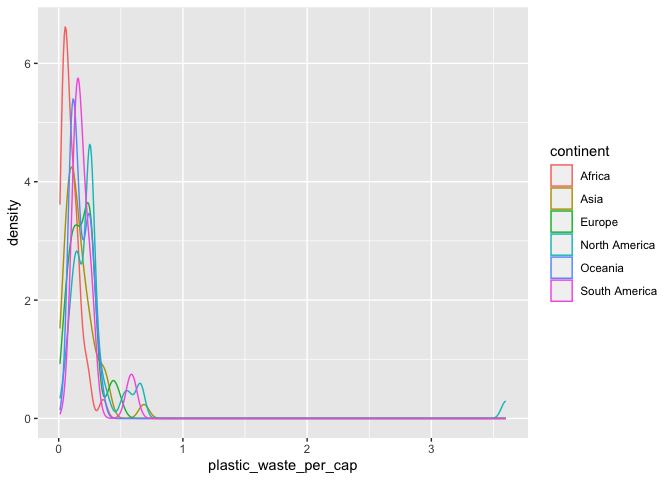
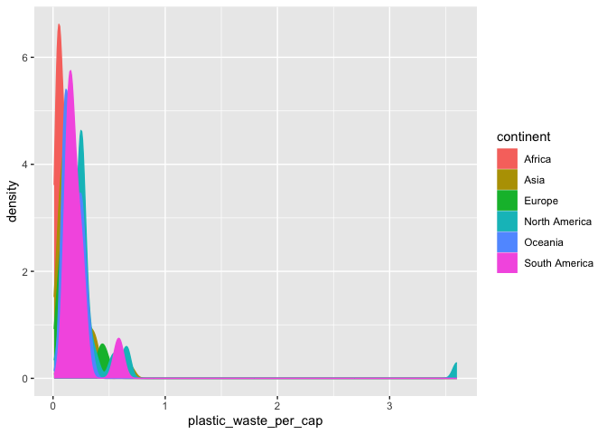
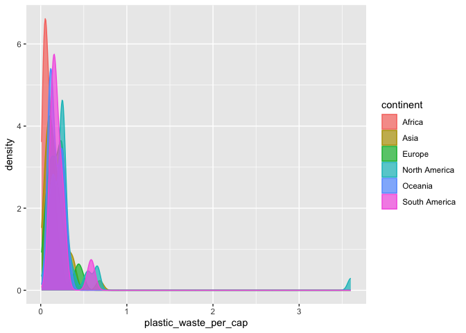

Lab 02 - Plastic waste
================
Heather Hawkins
01/17/23

## Load packages and data

``` r
library(tidyverse) 
```

``` r
plastic_waste <- read_csv("data/plastic-waste.csv")
```

## Exercises

``` r
ggplot(data = plastic_waste, aes(x = plastic_waste_per_cap)) +
  geom_histogram(binwidth = 0.2)
```

    ## Warning: Removed 51 rows containing non-finite values (`stat_bin()`).

<!-- -->

``` r
plastic_waste %>%
  filter(plastic_waste_per_cap > 3.5)
```

    ## # A tibble: 1 × 10
    ##   code  entity     conti…¹  year gdp_p…² plast…³ misma…⁴ misma…⁵ coast…⁶ total…⁷
    ##   <chr> <chr>      <chr>   <dbl>   <dbl>   <dbl>   <dbl>   <dbl>   <dbl>   <dbl>
    ## 1 TTO   Trinidad … North …  2010  31261.     3.6    0.19   94066 1358433 1341465
    ## # … with abbreviated variable names ¹​continent, ²​gdp_per_cap,
    ## #   ³​plastic_waste_per_cap, ⁴​mismanaged_plastic_waste_per_cap,
    ## #   ⁵​mismanaged_plastic_waste, ⁶​coastal_pop, ⁷​total_pop

### Exercise 1

Remove this text, and add your answer for Exercise 1 here.

``` r
ggplot(data = plastic_waste,
       aes(x = plastic_waste_per_cap)) +
  geom_density()
```

    ## Warning: Removed 51 rows containing non-finite values (`stat_density()`).

<!-- -->

``` r
ggplot(data = plastic_waste, 
       mapping = aes(x = plastic_waste_per_cap, 
                     color = continent)) +
  geom_density()
```

    ## Warning: Removed 51 rows containing non-finite values (`stat_density()`).

<!-- -->

``` r
ggplot(data = plastic_waste, 
       mapping = aes(x = plastic_waste_per_cap, 
                     color = continent, 
                     fill = continent)) +
  geom_density()
```

    ## Warning: Removed 51 rows containing non-finite values (`stat_density()`).

<!-- -->

``` r
ggplot(data = plastic_waste, 
       mapping = aes(x = plastic_waste_per_cap, 
                     color = continent, 
                     fill = continent)) +
  geom_density(alpha = 0.7)
```

    ## Warning: Removed 51 rows containing non-finite values (`stat_density()`).

<!-- -->

### Exercise 2

``` r
# insert code here
```

### Exercise 3

Remove this text, and add your answer for Exercise 3 here.

### Exercise 4

Remove this text, and add your answer for Exercise 4 here.

``` r
# insert code here
```

### Exercise 5

Remove this text, and add your answer for Exercise 5 here.

``` r
# insert code here
```

### Exercise 6

Remove this text, and add your answer for Exercise 6 here.

``` r
# insert code here
```

### Exercise 7

Remove this text, and add your answer for Exercise 7 here.

``` r
# insert code here
```

``` r
# insert code here
```

### Exercise 8

Remove this text, and add your answer for Exercise 8 here.

``` r
# insert code here
```

## Pro-Tips

### Excercise 3

Try this :D

ggplot(data = plastic_waste, mapping = aes(x = continent, y =
plastic_waste_per_cap)) + geom_violin()+ geom_boxplot(width=.3,
fill=“green”) + stat_summary(fun.y=median, geom=“point”)

### Exercise 5

Helpful
reference:<http://www.sthda.com/english/wiki/ggplot2-themes-and-background-colors-the-3-elements>
